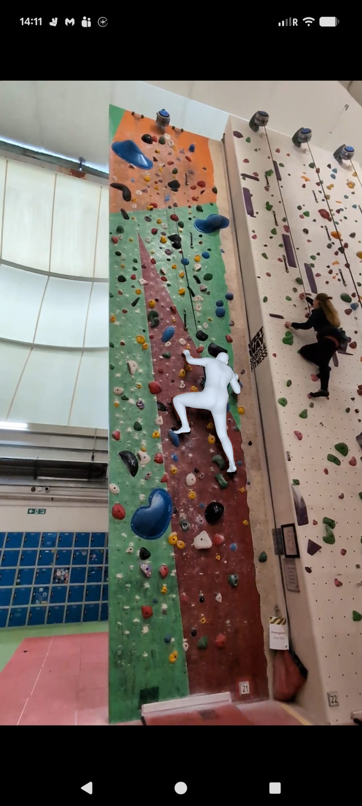
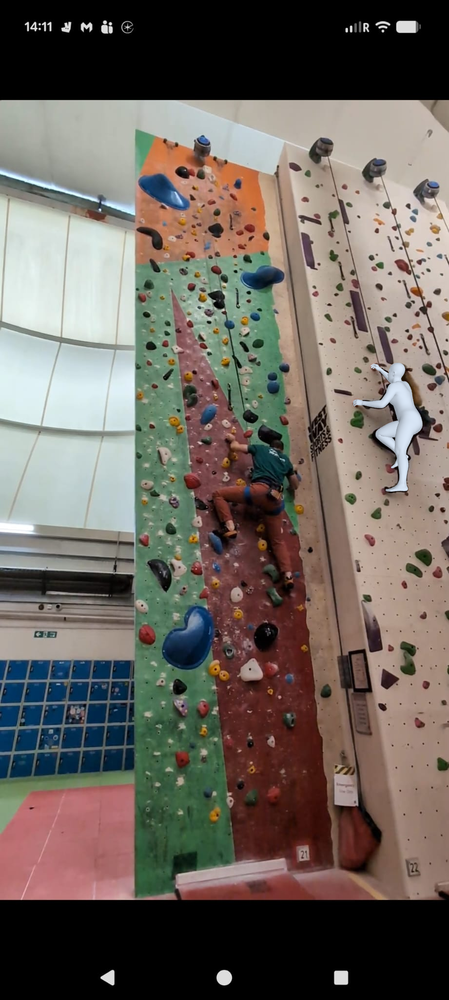
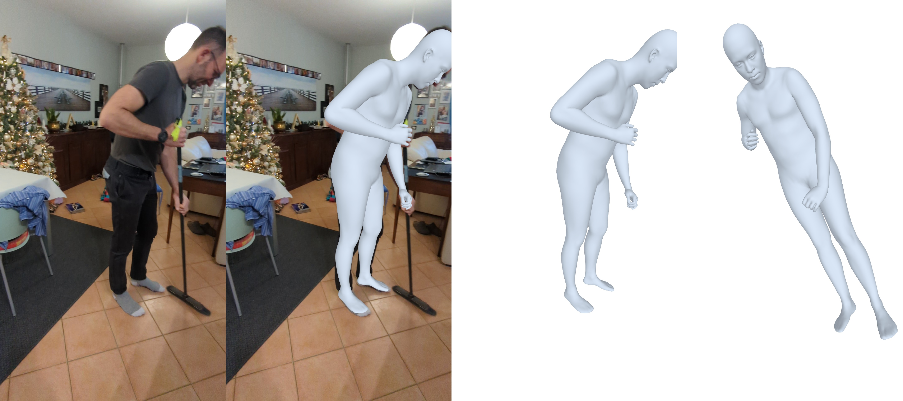

# SAM-3D Body Experiments

Personal experiments with [SAM-3D Body](https://github.com/facebookresearch/sam-3d-body) — Meta's model for 3D human body mesh estimation from single images and videos.

## Examples

**Static image** — 3D mesh overlay on climbers from a single photo:




**Video** — per-frame mesh estimation (original → mesh overlay → front view → side view):



## Contents

- `test_diego.ipynb` — notebook with the following sections:
  1. Imports and model loading
  2. Process image and get outputs
  3. 2D visualization — keypoints and bounding boxes
  4. 3D mesh visualization — overlay and side view
  5. Save 3D mesh files and results
  6. Video mesh with person selection
- `utils.py` — helper wrappers around the SAM-3D Body API (model setup, visualization, mesh saving)

## Setup

Follow the installation instructions from the upstream repo:

```bash
git clone https://github.com/facebookresearch/sam-3d-body.git
cd sam-3d-body
# follow INSTALL.md
```

Then place this notebook and `utils.py` inside the `notebook/` folder of that clone.

## Reference

> Weinzaepfel et al., *SAM-3D Body: Towards General 3D Human Pose and Shape Estimation*, Meta AI Research.
> https://github.com/facebookresearch/sam-3d-body
